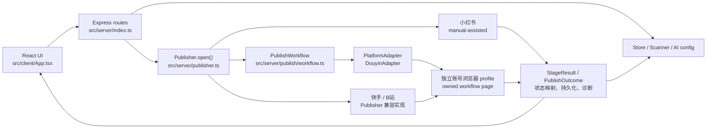

# AI / 开发维护交接文档

更新时间：2026-07-22

项目：自动发布视频工具

工作目录：`D:\4.文档\AI相关\AI项目\自动发布视频`

仓库：`https://github.com/aiden609906-sketch/Video-Auto-Publisher`

## 1. 当前稳定基线

- 正式主分支：`main`
- 当前稳定标签：`V3.0`
- `V3.0` 对应提交：`227fe9a`
- 稳定代码版本关系：`v1.0.0 → v2.0.5 → V3 重构 → V3.0`
- 早期阶段性 V3 标签已经删除，恢复稳定版时只使用大写的 `V3.0`。

标签是某次提交的只读快照，不是独立代码目录，也不是长期维护分支。`main` 可能在 `V3.0` 之后继续增加文档或新修改，因此排查回归时先区分“当前 main”与“V3.0 稳定代码快照”。

安全查看稳定版的方法：

```powershell
git switch -c restore-v3 V3.0
```

不要为了查看历史版本直接执行 `git reset --hard`。

## 2. 产品边界

这是一个 Windows 本地视频发布辅助工具，管理视频、横竖封面、平台文案、账号浏览器资料、AI 文案配置、发布过程状态和素材归档。

平台模式：

| 平台 | 模式 | 当前行为 |
| --- | --- | --- |
| 抖音 | managed | V3 阶段工作流：视频、横竖封面、标题、正文、AI 声明、最多 5 个纯文本话题 |
| 快手 | managed | 视频、封面、作品描述、最多 4 个话题、AI 声明；标题合并到作品描述首行 |
| B站 | managed | 视频、封面制作窗口、标题、正文、标签、“含AI生成内容”声明 |
| 小红书 | manual-assisted | 打开发布页和素材目录，把标题、正文、话题复制到剪贴板；用户手动上传、粘贴和发布 |

任何平台的最终“发布”按钮都由用户人工检查后点击。除非用户明确授权真实发布，否则验证只做到发布前状态。

## 3. 必须遵守的安全约束

- 不读取后原样输出 `.env`、`data/ai-config.json`、Cookie、API Key、浏览器资料或真实账号内容。
- `data/browser-profiles` 保存真实登录态；不要提交、复制到公开位置或发给第三方。
- `data/diagnostics` 和页面截图可能包含头像、账号名、素材和平台状态，分享前必须脱敏。
- 删除大量文件前先征得用户确认。
- “重置浏览器”会删除账号 profile，是不可恢复操作；必须明确目标平台和账号。
- Windows PowerShell 5.1 对复杂 JSON、嵌套引号和反斜杠的参数传递不可靠。复杂请求使用受控临时 JSON 文件、参数数组或 SDK；线上写操作前先用相同传参方式验证只读接口。
- 不通过随机鼠标轨迹、指纹伪装、代理轮换等方式绕过平台风控。小红书保持辅助手动模式。
- 不把“触发了点击”视为成功。每个自动阶段必须验证页面后置状态。

## 4. 技术栈与运行方式

- Node.js 20+
- TypeScript / ESM
- React 19 + Vite
- Express 5
- Playwright Core
- 本地 JSON/文件存储，无数据库
- Node 内置 test runner

常用命令：

```powershell
npm run check
npm run build
npm run start
npm run dev
node --import tsx --test tests/*.test.ts
```

正式服务默认监听 `127.0.0.1:8787`。Vite 开发页面为 5173 端口。

## 5. 系统数据流



主要请求链：

1. 前端调用 `POST /api/videos/:id/posts/:platform/open`。
2. `src/server/index.ts` 选择视频、平台文案和发布账号，建立进度记录。
3. `Publisher.open()` 先复制文案，再按平台选择 manual 或 managed 路径。
4. 小红书打开外部浏览器和素材目录后返回“材料已准备”。
5. 抖音通过 `PublishWorkflow` 和 `DouyinAdapter` 执行阶段状态机。
6. 快手、B站暂时仍在 `Publisher` 的兼容流程中执行，并返回旧布尔结果。
7. `normalizePublishOutcome()` 把旧结果转换为 `PublishOutcome`。
8. `mapPublishOutcome()` 决定任务状态、诊断状态和用户提示。
9. `Store` 持久化结果，`Diagnostics` 写入发布诊断。

## 6. 源码模块地图

### 前端

| 文件 | 职责 |
| --- | --- |
| `src/client/App.tsx` | 主界面、数据请求、任务编辑、账号选择、发布/归档/诊断交互；文件较大 |
| `src/client/publish-notice.ts` | 将发布结果转换为用户可读提示 |
| `src/client/selection.ts` | 刷新任务列表时保留或回退当前选择 |
| `src/client/styles.css` | 全局界面样式 |
| `src/client/main.tsx` | React 入口 |

### 服务端业务模块

| 文件 | 职责 |
| --- | --- |
| `src/server/index.ts` | Express 入口、路由、发布编排、进度 Map、状态持久化和诊断写入 |
| `src/server/store.ts` | 视频、平台文案、账号、设置的本地状态及迁移 |
| `src/server/scanner.ts` | 手动扫描 inbox、计算视频哈希、识别图片方向、匹配视频和封面 |
| `src/server/archive.ts` | 将视频和 inbox 内关联封面移动到独立时间戳目录，失败时回滚已移动文件 |
| `src/server/ai-config.ts` | AI 服务配置的本地保存和脱敏视图 |
| `src/server/openai.ts` | AI 文案生成和连接测试 |
| `src/server/diagnostics.ts` | 诊断元数据和诊断文件管理 |
| `src/server/environment.ts` | Node、浏览器、目录和适配器环境检查 |
| `src/server/account-matrix.ts` | 平台/账号到浏览器 profile 的路径映射 |
| `src/server/publish-account.ts` | 请求账号、文案保存账号和平台归属校验 |
| `src/server/copy.ts` | 把标题、正文和 `#话题` 格式化为剪贴板文本 |
| `src/server/config.ts` | 端口和数据目录配置 |
| `src/server/publisher.ts` | 浏览器生命周期、manual 路径、managed 入口、快手/B站流程和大量兼容页面操作；当前最大耦合点 |

### V3 发布工作流

| 文件 | 接口或职责 |
| --- | --- |
| `src/server/publish/platform-adapter.ts` | `PlatformAdapter` seam、`PublishInput` 和 managed 平台类型 |
| `src/server/publish/workflow.ts` | 按适配器 `stageOrder` 顺序执行，阶段失败时立即停止 |
| `src/server/publish/types.ts` | managed 必需阶段、`buildPublishOutcome()` 和旧结果转换 |
| `src/server/publish/result-mapping.ts` | 新旧结果归一化以及状态、HTTP、进度提示映射 |
| `src/server/publish/account-lock.ts` | 同一平台同一账号的进程内互斥锁 |
| `src/server/publish/page-owner.ts` | 复用一个目标平台页面，关闭重复平台页和空白页 |
| `src/server/publish/adapters/douyin.ts` | 当前唯一完整进入 V3 seam 的平台适配器；持有抖音阶段验证和安全错误证据 |

### 共享类型

`src/shared/types.ts` 定义平台、任务、账号、封面、发布阶段、`StageResult`、`PublishOutcome`、AI 配置和环境检测类型，是前后端共同依赖的接口。

## 7. V3 发布模型

发布阶段定义为：

```text
page → video → title → body → topics → cover → declaration → ready
```

适配器可以通过 `stageOrder` 改变顺序，但必须恰好包含该平台要求的每个阶段。`PublishWorkflow` 按顺序调用 `runStage()`，第一个 `failed` 会停止后续阶段。

阶段结果：

```ts
type StageResult = {
  stage: PublishStage;
  status: "succeeded" | "failed";
  detail: string;
  evidence?: Record<string, string | number | boolean>;
};
```

`evidence` 只能保存安全状态，例如元素数量、布尔状态、长度或脱敏摘要，不应保存页面正文、账号名、Cookie 或文件真实内容。

`PublishOutcome` 的含义：

- `complete`：该平台所有必需阶段都经过验证。
- `partial`：至少一个阶段失败或旧兼容结果缺少完整验证。
- `login_required`：页面阶段确认需要登录。
- `failed`：没有形成可用的发布准备结果。

## 8. 平台实现现状

### 抖音

真正的 V3 适配器在 `src/server/publish/adapters/douyin.ts`。

当前顺序：

```text
page → video → cover → title → body → declaration → topics
```

关键特征：

- 上传后验证当前视频来源和发布表单状态，避免把旧表单误认为本次上传。
- 横屏、竖屏封面通过 `Publisher.uploadDouyinCovers()` 回调完成；这仍是 V3 adapter 与旧 `Publisher` 的内部耦合。
- 正文单独写入，话题最后以最多 5 个去重后的 `#话题` 纯文本追加。
- 不点击话题候选项；即使出现推荐浮层，也只验证正文中实际写入的纯文本。
- AI 声明要求单选状态生效并关闭声明弹窗。
- 抖音流程不检查最终发布按钮，不点击发布。

主要测试：

- `tests/douyin-adapter.test.ts`
- `tests/douyin-body-topic-dom.test.ts`
- `tests/publisher-douyin-fill.test.ts`
- `tests/fixtures/publisher/douyin/`

### 快手

快手暂时没有独立 `PlatformAdapter`，逻辑集中在 `src/server/publisher.ts`。

当前行为：

- 最多保留 4 个去重话题。
- 作品描述写入格式为 `标题\n正文\n#话题1 #话题2`，不再填写独立标题输入框。
- 上传封面后依次验证上传预览、确认弹窗关闭和主页封面变化。
- 封面无法验证时立即停止，不继续选择作者声明。
- 作者声明必须读取到“内容由AI生成”或“内容为AI生成”的已选值才算成功。
- 完成已验证字段后停止，最终发布由用户处理。

主要测试：

- `tests/kuaishou-topics.test.ts`
- `tests/kuaishou-cover-dom.test.ts`
- `tests/kuaishou-ai-dom.test.ts`
- `tests/publisher-douyin-fill.test.ts`

### B站

B站暂时没有独立 `PlatformAdapter`，逻辑也在 `src/server/publisher.ts`。

当前行为：

- 上传视频或复用已打开的发布表单。
- 填写标题、正文和标签；独立标签输入最多创建 10 个标签。
- 封面制作窗口要求两个封面输入都完成，然后点击右下角“完成”，并验证编辑器关闭。
- 创作声明选择“含AI生成内容”，验证时读取可见文本或输入控件值，同时排除下拉候选和下方“人工智能”分区的干扰。
- 最终发布由用户处理。

兼容限制：B站旧结果没有独立的 `ready` 验证，`normalizePublishOutcome()` 会补一个失败的 ready 阶段；复用已经打开的发布表单时，旧代码也可能因为本轮没有新的 video input 而把 video 标记为未预填。因此排查 B站时必须查看逐阶段结果，不要只看总体 `partial`。

主要测试：

- `tests/kuaishou-ai-dom.test.ts` 中的 B站声明回归
- `tests/publisher-douyin-fill.test.ts` 中的 B站封面回归
- `tests/publish-result-mapping.test.ts`

### 小红书

`getPublishMode("xiaohongshu")` 返回 `manual`，不进入 Playwright managed workflow。

流程：

1. `Publisher.copy()` 使用 `formatPostText()` 把标题、正文、话题写入剪贴板。
2. `openManualPublishPage()` 使用所选账号独立 profile 打开小红书发布页。
3. 同时打开视频和已有关联封面所在目录。
4. 返回人工材料准备完成，用户自己上传、粘贴、选择声明并发布。

主要测试：

- `tests/publisher-manual-mode.test.ts`
- `tests/publish-result-mapping.test.ts`
- `tests/publish-notice.test.ts`

## 9. 当前主要耦合

### 9.1 `publisher.ts` 是超大模块

`src/server/publisher.ts` 约 3100 行，同时管理：

- persistent browser context 生命周期。
- 平台/账号 profile。
- 页面复用和文件选择兜底。
- manual-assisted 路径。
- 快手和 B站全部页面操作。
- 抖音封面兼容回调和大量已不可达旧抖音代码。
- DOM 查找、点击、等待、验证和调试截图。

影响：一个平台的公共选择器、等待方法或浏览器改动可能误伤其他平台；维护者很难只加载一个平台所需上下文。

### 9.2 V3 seam 目前只有一个完整 adapter

`PlatformAdapter` seam 目前只有 `DouyinAdapter`。快手、B站仍通过旧布尔结果进入 `normalizePublishOutcome()`，导致状态语义不完全一致。

影响：同样的“成功”在抖音表示阶段后置条件已验证，在旧平台可能只表示兼容函数返回 true；B站还存在 ready 阶段无法完成的问题。

### 9.3 抖音 adapter 仍依赖 `Publisher` 封面回调

`DouyinAdapter` 的 cover 阶段调用构造时传入的 `uploadCovers`，实际实现仍是 `Publisher.uploadDouyinCovers()`。

影响：抖音适配器不能单独承担完整平台行为，修改封面流程需要同时理解两个大文件。

### 9.4 `index.ts` 同时承担路由和发布用例

`src/server/index.ts` 约 426 行，既定义 HTTP 路由，也选择账号、管理发布进度、调用 Publisher、映射结果、更新 Store 和写诊断。

影响：发布状态或错误策略变化容易同时修改网络层和业务编排，端到端测试成本较高。

### 9.5 外部 DOM、中文文案和时序耦合

托管平台依赖创作者页面的选择器、中文标签、弹窗结构、文件 input、上传进度和异步处理时间。

影响：平台改版无需仓库代码变化就能破坏自动化；固定 sleep 不能证明成功，必须优先使用可观察后置条件。

### 9.6 账号、context、page 和互斥锁共同变化

账号 ID 决定 profile 路径和 context key；`PublishAccountLock` 用相同 key 阻止并发；`createWorkflowPage()` 又负责同 context 内页面复用。

影响：修改账号模型、profile 目录或页面复用时必须同时检查锁键、重置逻辑和相关测试。

### 9.7 测试直接调用私有方法

部分回归测试把 `Publisher` 转成 `Record<string, unknown>`，再直接替换或调用私有方法。

影响：私有方法改名或拆文件会造成大量测试机械修改。这些测试能保护历史 bug，但也暴露当前 seam 不够深。

## 10. 推荐重构顺序

只在有明确需求时重构，不要为“看起来更干净”同时改动全部平台。

1. 先让快手实现 `PlatformAdapter`，用现有 `PublishWorkflow` 替换对应兼容分支；快手已有明确阶段、限制和较多回归测试，适合作为第二个 adapter。
2. 再迁移 B站，并在迁移时实现真实 `ready` 或明确移除不需要的 ready 要求，消除“字段成功但总体 partial”的兼容问题。
3. 把抖音封面实现移动到 `DouyinAdapter` 内部或提取为只属于抖音实现的内部 seam，删除 V3 对 `Publisher` 封面回调的依赖。
4. 三个平台迁移后，删除 `publisher.ts` 中不可达的旧抖音分支和不再使用的通用猜测逻辑；不要在迁移前先删。
5. 最后从 `index.ts` 提取发布用例模块，使路由只负责解析请求和返回结果。

每次迁移只处理一个平台，并保持现有 `PlatformAdapter` interface 小而稳定。避免在旧实现外面再套一层转发；应以新 adapter 替换旧分支。

## 11. 修改导航

| 修改目标 | 先看代码 | 重点测试 |
| --- | --- | --- |
| 前端任务选择/刷新 | `src/client/App.tsx`, `src/client/selection.ts` | `tests/selection-state.test.ts` |
| 发布结果提示 | `src/client/publish-notice.ts`, `src/server/publish/result-mapping.ts` | `tests/publish-notice.test.ts`, `tests/publish-result-mapping.test.ts` |
| 账号选择和并发 | `src/server/publish-account.ts`, `src/server/account-matrix.ts`, `src/server/publish/account-lock.ts` | `tests/publish-account-selection.test.ts`, `tests/publish-account-lock.test.ts`, `tests/account-matrix.test.ts` |
| 页面复用/重复标签页 | `src/server/publish/page-owner.ts`, `Publisher.getContext()` | `tests/publisher-page-isolation.test.ts` |
| 抖音流程 | `src/server/publish/adapters/douyin.ts`, `Publisher.uploadDouyinCovers()` | `tests/douyin-adapter.test.ts`, `tests/douyin-body-topic-dom.test.ts`, `tests/publisher-douyin-fill.test.ts` |
| 快手话题 | `hashtagsForPlatform()`, `tryFillBody()` | `tests/kuaishou-topics.test.ts` |
| 快手封面/声明 | `src/server/publisher.ts` 中 Kuaishou 方法 | `tests/kuaishou-cover-dom.test.ts`, `tests/kuaishou-ai-dom.test.ts` |
| B站封面/声明 | `src/server/publisher.ts` 中 Bilibili 方法 | `tests/publisher-douyin-fill.test.ts`, `tests/kuaishou-ai-dom.test.ts` |
| 小红书辅助模式 | `getPublishMode()`, `openManualPublishPage()`, `src/server/copy.ts` | `tests/publisher-manual-mode.test.ts`, `tests/publish-result-mapping.test.ts` |
| 扫描和封面匹配 | `src/server/scanner.ts` | `tests/scanner-mode.test.ts` |
| 归档 | `src/server/archive.ts`, `src/server/index.ts` 的 archive route | 最小文件系统回归与归档路由验证 |
| AI 配置/生成 | `src/server/ai-config.ts`, `src/server/openai.ts` | 类型检查、连接测试的受控验证 |

## 12. 测试和真实页面验证

提交前至少运行：

```powershell
npm run check
node --import tsx --test tests/*.test.ts
git diff --check
```

不要在文档或回复中沿用旧测试数量。只有读取到本轮完整测试输出后，才能报告本轮通过数量。

平台 bug 推荐流程：

1. 根据用户截图和最新诊断确定失败阶段。
2. 先写能复现误判或漏操作的最小回归测试，并确认修复前失败。
3. 做最小生产修改。
4. 跑目标测试，再跑类型检查和全量测试。
5. 重启本地服务，确认加载的是新代码。
6. 在真实创作者页面验证到发布前状态，保留关键截图。
7. 不主动点击最终发布按钮。

DOM fixture 能验证选择器和状态机，但不能代替真实平台页面验证；真实页面测试也不能代替可重复回归测试，两者都需要。

## 13. 已知风险

- 外部平台 DOM、中文文案、上传流程和异步时间随时可能变化。
- B站仍是兼容结果模型，总体状态可能因为 video/ready 验证显示 partial。
- persistent profile 含真实登录态，测试隔离不足时可能使用真实账号。
- `PublishAccountLock` 和 `publishProgress` 都是单进程内存状态；如果未来运行多个服务进程，不能提供跨进程互斥或共享进度。
- 本地 Store 没有数据库事务；涉及多个状态写入时需要注意中途失败。
- 诊断截图和日志可能包含用户素材或账号信息。
- `resetProfile()` 会递归删除指定 profile，改动其目标计算时必须先验证绝对路径范围。

## 14. 新维护者接手步骤

1. 阅读 `README.md` 了解用户承诺和平台边界。
2. 检查 Git 状态，不要覆盖用户已有修改：

   ```powershell
   git status --short
   git log --oneline --decorate -n 20
   ```

3. 确认没有读取或输出敏感配置，再运行类型检查和相关测试。
4. 根据失败平台从“修改导航”进入最小代码范围。
5. 保留用户已有 `data`、浏览器资料、素材和未提交文档。
6. 真实页面测试前确认目标账号和素材；最终发布需要再次获得明确授权。
7. 修复完成后提交到明确分支或按用户要求合入 `main`，再推送 GitHub。

## 15. 建议使用的技能

- `diagnosing-bugs` 或 `superpowers:systematic-debugging`：平台卡住、漏填、误报成功时先定位根因。
- `tdd` 或 `superpowers:test-driven-development`：在生产修改前建立最小回归测试。
- `codebase-design`：迁移快手/B站 adapter 或缩小 `publisher.ts` interface 时使用。
- `superpowers:verification-before-completion`：声称完成、提交或推送前执行新鲜验证。
- `github:yeet`：需要整理提交、推送分支或创建 PR 时使用；先保护用户未提交文件。

## 16. 交接完成标准

新的维护者不依赖历史对话，也应能够从本文档回答：

- 当前稳定恢复点在哪里。
- 四个平台分别走哪种发布模式。
- 一次发布请求经过哪些模块。
- V3 workflow 与旧兼容流程在哪里交汇。
- 修改某个平台应进入哪些代码和测试。
- 哪些步骤有外部副作用，哪些数据不能泄露。
- 当前最值得优先降低的耦合是什么。
